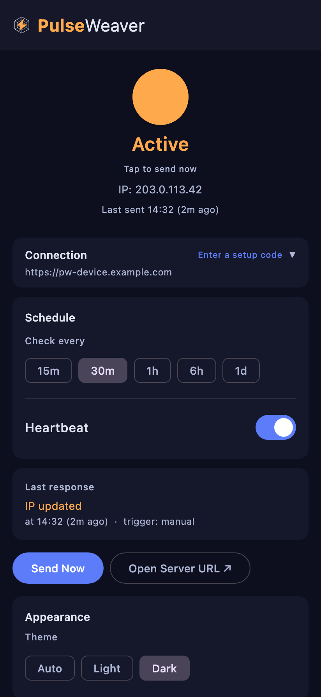
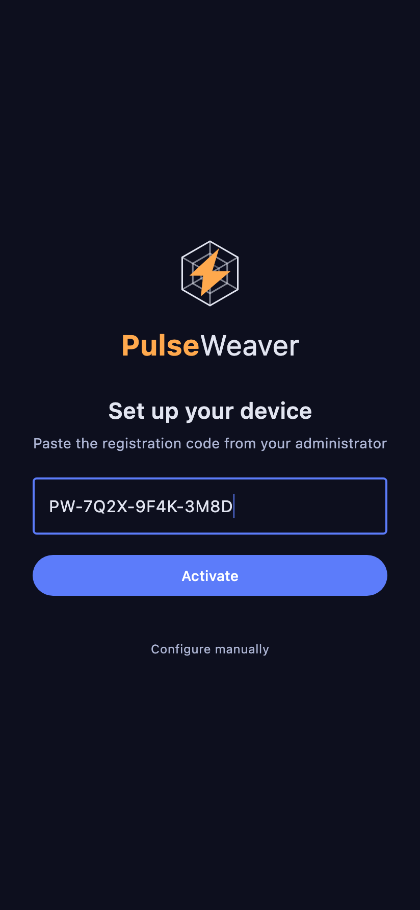

# PulseWeaver Companion

**PulseWeaver Companion** is the full-featured heartbeat client for phones and desktops — the app
that keeps your device authorized on a PulseWeaver server without you thinking about it. It runs in
the background, re-announces your address the moment you change networks, and after a one-time setup
needs no further attention.

## Features

- **Background heartbeats** — configurable interval, runs without user interaction
- **Network-aware** — detects connectivity changes and sends a heartbeat immediately when back online
- **Manual heartbeat** — tap the status circle any time to send one right now (see [Sending a heartbeat manually](#sending-a-heartbeat-manually))
- **Biometric lock** (Android) — optionally require fingerprint/face to view or change settings, with a 60-second grace
  period
- **System tray** (Desktop) — lives in the tray with a state-aware icon; no window needed after setup
- **Light / Dark / Auto theme** — follows your system preference or pick manually
- **Minimal permissions, no telemetry** — no accounts, and the only network destination is the PulseWeaver server you own and configure (details in [Permissions, privacy & key storage](#permissions-privacy--key-storage))

> **Tip for mobile / dynamic IP devices**
>
> A good, battery-friendly pairing for a phone is a **~30-minute heartbeat interval with a ~1-hour
> server address lease**. Set two per-device rules on the PulseWeaver server so roaming stays clean:
> * **address lease** — a TTL that must sit above your worst-case heartbeat gap. ~1 hour is a good
>   default for phones and laptops; under Android Doze the effective gap can reach ~30 minutes, so
>   don't set the lease shorter than that or it will flap.
> * **max active addresses** — cap it at 2. Roaming expires old IPs via the lease, but during travel
>   (e.g. a moving car) the IP can change faster, and keeping 2 avoids dropping mid-switch.
>
> Full reasoning: [Recommended settings for roaming devices](https://github.com/DiegoGuidaF/PulseWeaver/blob/main/docs/Connecting-Devices.md#recommended-settings-for-roaming-devices).

> **Android: turn off battery optimization**
>
> Android's Doze / App Standby pauses background apps, especially on a phone that has been asleep —
> locked and unused — for a while, and can defer the heartbeat by hours, letting the device's access
> expire. On first run the app shows a reliability prompt — tap **Open settings**, find PulseWeaver
> Companion in the battery-optimization list, and turn optimization **off**. This is required for the
> background schedule to run on time. Admins: this is the first thing to check when a user reports
> their access dropping.

## Sending a heartbeat manually

The main screen shows a status circle at the top. **Tap it to send a heartbeat right now** — it's
the same request the background schedule sends, just on demand. Use it any time you want to confirm
connectivity immediately: right after setup, after switching networks, or when you've just been
granted access to a new host and don't want to wait for the next scheduled beat.

<p >
  
</p>

> _Screenshots are captured from the desktop build. The phone UI is the same shared layout, with
> minor platform differences (e.g. the **Send Now** button is desktop-only; the phone adds a QR
> scanner on setup)._

## How many devices need the app?

PulseWeaver gates by the IP it actually sees, so you may need fewer clients than you have devices:

- **Several devices behind the same router on a network that is *not* where your PulseWeaver server
  lives** (a home, an office, a friend's place — they all share that network's one public IP from the
  server's point of view): only **one** device there needs to run a client. Its heartbeat keeps that
  shared address active for everything else on the same network.
- **A device with a fixed address** (a home server, a desktop on a reserved DHCP lease) doesn't need
  a client at all — its IP can be [registered manually](https://github.com/DiegoGuidaF/PulseWeaver/blob/main/docs/Connecting-Devices.md#manual--static-ip-devices) once, with no periodic heartbeat.
- **Devices on the same local network as the server, and devices on IPv6**, are each seen by their
  own address, so they each need their own heartbeat or a network policy (CIDR) that covers them.

Which case you're in depends on how your network reaches the server. The details (and the security
implications of a shared IP) are in the server's [Shared-IP model](https://github.com/DiegoGuidaF/PulseWeaver/blob/main/docs/Shared-IP-Model.md).

## Checking it's working

After setup, confirm the **server** is actually seeing your heartbeats: open the device in the
PulseWeaver dashboard and look at its **address history** — a fresh entry should appear each
interval, and the `Δ prev` column flags when the gap between heartbeats is creeping toward the
address lease (so you can raise the interval or the lease before access drops). See
[Verifying a device is connected](https://github.com/DiegoGuidaF/PulseWeaver/blob/main/docs/Connecting-Devices.md#verifying-a-device-is-connected).

## Permissions, privacy & key storage

**Android permissions.** The app requests only what the heartbeat needs:

| Permission | Why |
|---|---|
| `INTERNET` | Send the heartbeat POST |
| `ACCESS_NETWORK_STATE` | Detect connectivity changes and re-heartbeat immediately when back online |
| `RECEIVE_BOOT_COMPLETED` | Resume the schedule after a reboot |
| `USE_BIOMETRIC` | The optional fingerprint/face lock — only used if you enable it |

No location, contacts, storage, or background-location permissions are requested.

**No telemetry.** The app talks to exactly one network destination: the server URL you configure (the heartbeat, plus a one-time pairing claim during setup). There is no analytics or crash-reporting backend. Because the app is open source ([AGPL-3.0](../LICENSE)), you can verify this yourself — see [Building from source](#building-from-source).

**Where your API key is stored.** The key lives in the platform's app-private configuration store; the app does not separately encrypt it:

- **Android** — Jetpack DataStore in app-private internal storage. On Android 10+ this is covered by the OS file-based encryption; on older versions it's protected by the app sandbox.
- **Desktop** — the Java user-preferences store under your OS user profile. This is **not** encrypted, so rely on your OS account and disk encryption to protect it.

The **biometric lock gates the app UI only** (viewing and changing settings) — it does **not** encrypt the stored key. Someone with filesystem or backup access is bounded by the platform storage protection above, not by the lock.

## Supported platforms

| Platform | Status     | Background scheduling       |
|----------|------------|-----------------------------|
| Android  | ✅ Ready    | WorkManager (survives doze) |
| Linux    | ✅ Ready    | JVM timer + system tray     |
| Windows  | ✅ Ready    | JVM timer + system tray     |
| macOS    | ✅ Ready    | JVM timer + system tray     |
| iOS      | 🚧 Planned | BGAppRefreshTask            |

The app is pre-1.0: the platforms marked ✅ are functional and tested, but expect rough edges and breaking changes between releases.

## Installing

Download the latest release for your platform
from [GitHub Releases](https://github.com/DiegoGuidaF/pulseweaver-heartbeat-client/releases):

| Platform | Artifact                   |
|----------|----------------------------|
| Android  | `.apk`                     |
| Linux    | `.deb` / `.rpm` / AppImage |
| Windows  | `.msi`                     |
| macOS    | `.dmg`                     |

On Android you'll need to allow installing the `.apk` from your browser or files app ("install unknown apps").

**Verifying your download.** Android release APKs are signed with the project's release key — inspect the certificate with `apksigner verify --print-certs <file>.apk`, and note that Android refuses to install an update signed by a different key. The desktop installers (`.deb` / `.dmg` / `.msi`) are not yet signed or notarized and no checksums are published; if you need stronger assurance, [build from source](#building-from-source).

## Device pairing

The recommended way to set up the app. The PulseWeaver administrator creates a pairing code and shares it with the
user (QR code or text string). The pairing code is single-use.

Steps the user needs to do:

1. Open the app — on first launch it goes straight to the **Setup screen**.
2. **Paste** the pairing code the administrator sent you.
3. Tap **Activate**. The app contacts the PulseWeaver server, registers the device, and auto-configures everything:
   server URL, API key, heartbeat interval, and security settings.
4. Done — the heartbeat starts immediately. The main screen shows the switch on and the time of the last heartbeat. If it doesn't activate, double-check the code with your admin — each pairing code is single-use.

<table>
  <tr>
    <td ><br><em>1. Paste the code, tap Activate</em></td>
    <td ><br><em>2. Heartbeat running right after</em></td>
  </tr>
</table>

> _Desktop capture — on a phone the Setup screen also shows a **Scan QR code** button above the
> code field, so you can scan the administrator's QR instead of pasting._

If the administrator enabled **Lock all app settings**, all settings are read-only with the only exception of appearance
settings (theme) which remain editable. This is not meant as a security measure, but it is intended to simplify user
interaction (and errors) since users might have big thumbs :)

To re-pair (e.g. after a server migration), the user can press **Enter a setup code** — the same kind of pairing code
the administrator generates. The app will ask for confirmation before replacing the current configuration. This removes all app configuration and allows the user to
reconfigure it (either via code or manually).

> For how the server side of pairing works (creating pairings, proxy setup, the pairing code format), see the
> [PulseWeaver server documentation](https://github.com/DiegoGuidaF/PulseWeaver#device-pairing).

### Pairing error codes

If activation fails, the app shows a plain-language message and a short
diagnostic code (e.g. `PWC-PAIR-EXPIRED`). Each code maps one-to-one to a cause
below, independent of the underlying HTTP status — read it back to your
administrator and they can tell what went wrong from the code alone.

| Code | What it means | What to do |
|------|---------------|------------|
| `PWC-PAIR-FORMAT` | The code couldn't be read — usually a partial copy/paste. | Re-copy the **whole** code and paste again, or scan the QR. |
| `PWC-PAIR-URL` | The code was read, but the server address inside it is invalid. | The code is likely truncated or was generated against a misconfigured server URL — ask your administrator for a fresh code. |
| `PWC-PAIR-REJECTED` | The server rejected the code (HTTP 400). | Ask your administrator for a new code. |
| `PWC-PAIR-EXPIRED` | The code has expired or was already used (HTTP 404/410). | Ask your administrator for a new code. |
| `PWC-PAIR-SERVER` | The server reported an error; the raw status is shown alongside (e.g. `HTTP 503`). | Try again shortly. If it persists, the administrator should check server logs. |
| `PWC-PAIR-NETWORK` | The device couldn't reach the server. | Check the device's internet connection and that the server is reachable. |

## Manual configuration

If you don't have a pairing code, tap **Configure manually** on the setup screen and fill in:

- **Server URL** — your PulseWeaver instance, on an endpoint that bypasses the forward-auth gate (e.g. `https://pw-device.example.com`)
- **API Key** — the `wdk_...` key from the PulseWeaver dashboard
- **Interval** — how often to send heartbeats (default: 60 seconds on desktop; on Android the minimum is 15 minutes)

Flip the switch to start. On desktop the app moves to the system tray.

## Building from source

Requires **JDK 17+** and the Android SDK (for Android builds).

```bash
# Run tests
./gradlew shared:jvmTest

# Desktop app (current OS)
./gradlew shared:run

# Android APK
./gradlew androidApp:assembleRelease

# Native desktop installers
./gradlew shared:packageDmg          # macOS
./gradlew shared:packageMsi          # Windows
./gradlew shared:packageDeb          # Linux .deb
./gradlew shared:packageRpm          # Linux .rpm
```

## Tech stack

| Layer    | Technology                                                             |
|----------|------------------------------------------------------------------------|
| Language | Kotlin 2.3.20                                                          |
| UI       | Compose Multiplatform 1.10.3                                           |
| HTTP     | Ktor 3.4.2                                                             |
| Build    | Gradle with version catalog, AGP 9.1.0                                 |
| Tests    | kotlin-test, kotlinx-coroutines-test, Ktor MockEngine, compose-ui-test |
